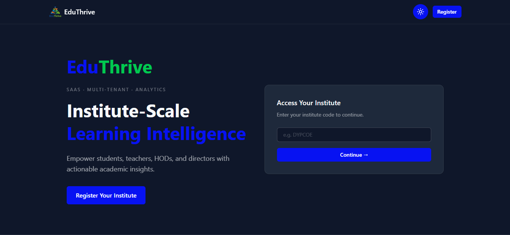
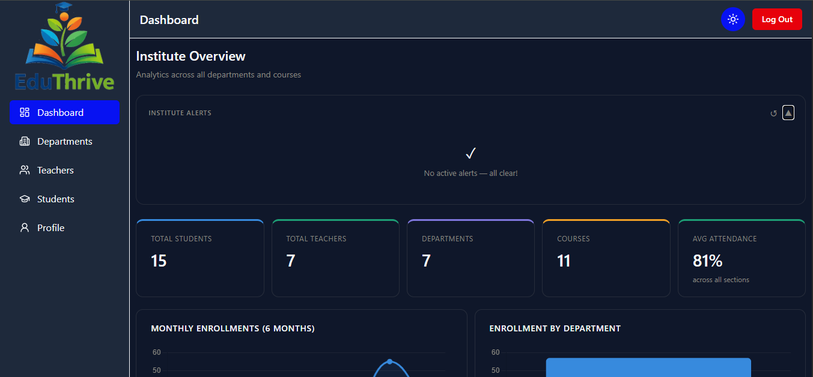
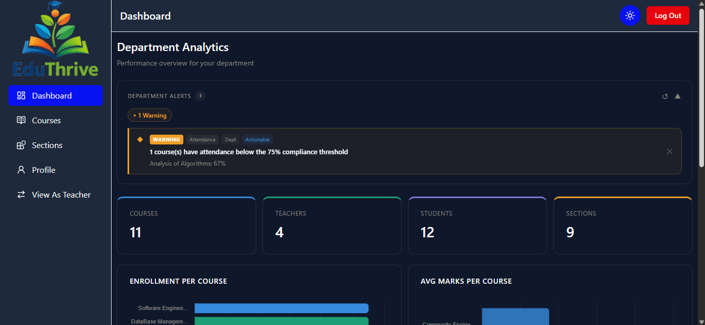
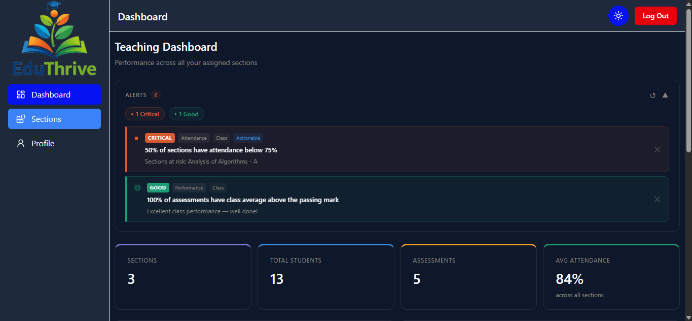
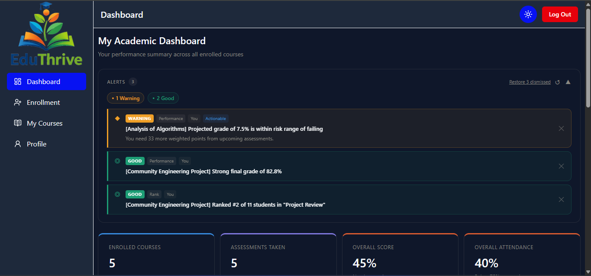

<p align="center">
  
</p>

<h1 align="center">EduThrive</h1>

<p align="center">
  <strong>Institute-Scale Learning Analytics Platform</strong><br/>
  A production-grade, multi-tenant SaaS built for educational institutions to manage academics, track performance, and govern at scale.
</p>

<p align="center">
  <a href="https://eduthrive-gamma.vercel.app" target="_blank">
    
  </a>
</p>

<p align="center">
  
  
  
  
  
  
</p>

---

## Table of Contents

- [Overview](#overview)
- [Live Demo](#live-demo)
- [Key Features](#key-features)
- [System Architecture](#system-architecture)
- [Tech Stack](#tech-stack)
- [Multi-Tenant Design](#multi-tenant-design)
- [Role-Based Access Control](#role-based-access-control)
- [Data Models](#data-models)
- [API Reference](#api-reference)
- [Getting Started](#getting-started)
- [Environment Variables](#environment-variables)
- [Project Structure](#project-structure)
- [Security](#security)
- [Future Improvements](#future-improvements)
- [Author](#author)

---

## Overview

EduThrive is a **full-stack SaaS application** that brings structured academic data management to educational institutes of any size. Each institute gets its own isolated environment under a unique URL slug — `/[instituteCode]/` — with four distinct role-based dashboards giving every stakeholder exactly the view they need.

The platform supports the complete academic lifecycle: from student enrollment and attendance tracking to assessment management, marks entry, and institute-wide performance governance — all under a single roof.

> **Built as a portfolio project** to demonstrate production-level architecture, multi-tenancy, JWT security, RESTful API design, and a polished full-stack workflow.

---

## Live Demo

🌐 **[https://eduthrive-gamma.vercel.app](https://eduthrive-gamma.vercel.app)**

Try the platform instantly using the demo institute **INS001**:

| Role | Email | Password |
|------|-------|----------|
| Director | `rajesh_sharma@ins001.edu` | `Pass@123` |
| HOD | `kunal_bandkar_cse@ins001.edu` | `Pass@123` |
| Teacher | `alakh_pandey_cse@ins001.edu` | `Pass@123` |
| Student | `cse00004@ins001.edu` | `Pass@123` |

> Login URL: [https://eduthrive-gamma.vercel.app/INS001](https://eduthrive-gamma.vercel.app/INS001)

---

## Key Features

### 🏢 SaaS Multi-Tenancy
- Every institute registers and gets its own scoped URL: `/INS001/`, `/INS001/student/dashboard`
- Complete data isolation between institutes enforced at the JWT level — no institute can access another's data
- Self-service institute registration with auto-generated director credentials

### 👥 Four Role-Based Dashboards
- **Director** — Institute governance: manage departments, teachers, students, and institute profile
- **HOD** — Department management: create courses, manage sections, assign teachers
- **Teacher** — Teaching tools: assessments, marks entry (bulk upsert), attendance marking
- **Student** — Academic view: course enrollment, marks history, attendance records

### 📊 Academic Management
- **Assessments** — Create and manage assignments, quizzes, midterms, and finals per section
- **Marks** — Paginated bulk marks entry with upsert logic (update if exists, insert if not)
- **Attendance** — Per-class attendance with present/absent toggling, date-based records, and summary stats
- **Enrollment** — Automatic section assignment (alphabetical, capacity-aware) on course enrollment

### 🔐 Secure Authentication
- JWT stored in `httpOnly` cookies (not localStorage) — XSS-safe
- Tokens carry `{ id, role, institute }` — institute isolation without touching the URL
- Token expiry handled gracefully with redirect to institute login
- Role-based middleware on every protected backend route

### 🎨 Polished UI/UX
- Light / dark mode with persisted preference
- Fully responsive — mobile sidebar with overlay, desktop persistent
- Consistent design system: CSS custom properties for colors, shared `Button` and `Input` components
- Toast notifications for all async actions

---

## 📸 Screenshots

### Landing Page
<p align="center">
  
</p>

### Director Dashboard
<p align="center">
  
</p>

### HOD Dashboard
<p align="center">
  
</p>

### Teacher Dashboard
<p align="center">
  
</p>

### Student Dashboard
<p align="center">
  
</p>

---

## System Architecture

```
┌─────────────────────────────────────────────────────────────┐
│                        CLIENT (Browser)                     │
│                                                             │
│   Next.js App Router  ·  Tailwind CSS v4  ·  React 19       │
│                                                             │
│   /                     Landing Page                        │
│   /register              Institute Registration             │
│   /[code]/login          Institute-scoped Login             │
│   /[code]/student/*      Student Dashboard                  │
│   /[code]/teacher/*      Teacher Dashboard                  │
│   /[code]/hod/*          HOD Dashboard                      │
│   /[code]/director/*     Director Dashboard                 │
└────────────────────────┬────────────────────────────────────┘
                         │  HTTPS  ·  httpOnly Cookie (JWT)
                         ▼
┌─────────────────────────────────────────────────────────────┐
│                    API SERVER (Render)                      │
│                                                             │
│   Express.js 5  ·  Cookie-Parser  ·  CORS                   │
│                                                             │
│   /api/auth/:code/login     Login (institute-scoped)        │
│   /api/institute/register   SaaS registration               │
│   /api/director/*           Director routes                 │
│   /api/hod/*                HOD routes                      │
│   /api/teacher/*            Teacher routes                  │
│   /api/student/*            Student routes                  │
│                                                             │
│   Middleware: protect() → allowRoles()                      │
└────────────────────────┬────────────────────────────────────┘
                         │  Mongoose ODM
                         ▼
┌─────────────────────────────────────────────────────────────┐
│                   MongoDB Atlas                             │
│                                                             │
│   Institute · Director · Teacher · Student                  │
│   Department · Course · Section · Enrollment                │
│   Assessment · Marks · Attendance                           │
└─────────────────────────────────────────────────────────────┘
```

---

## Tech Stack

| Layer | Technology | Purpose |
|-------|-----------|---------|
| **Frontend** | Next.js 16 (App Router) | File-based routing, SSR, layouts |
| **UI** | Tailwind CSS v4 | Utility-first styling with CSS variables |
| **Forms** | React Hook Form | Performant form state & validation |
| **Icons** | Lucide React | Consistent icon set |
| **Toasts** | React Hot Toast | Non-blocking async feedback |
| **Backend** | Node.js + Express 5 | REST API server |
| **Database** | MongoDB + Mongoose | Document store with schema validation |
| **Auth** | JSON Web Tokens | Stateless, institute-scoped authentication |
| **Security** | bcrypt | Password hashing with salt rounds |
| **Frontend Host** | Vercel | Edge-optimised Next.js deployment |
| **Backend Host** | Render | Auto-deploy from GitHub |

---

## Multi-Tenant Design

EduThrive uses **URL-slug-based multi-tenancy** — the cleanest pattern for SaaS educational tools.

### How it works

```
User visits → /DYPCOE/login
                   │
          POST /api/auth/DYPCOE/login
                   │
     Backend finds Institute where code = "DYPCOE"
                   │
     Scopes user lookup: Model.findOne({ email, institute: institute._id })
                   │
     Issues JWT: { id, role, institute: institute._id }
                   │
     All subsequent API calls use JWT institute field
     — URL never used again for data access
```

### Why this is secure

- The institute code in the URL is **only used at login** to scope which institute's user database to query
- After login, **every** protected route validates `req.user.institute` from the JWT — not from the URL
- An attacker cannot access another institute's data by changing the URL slug — the JWT locks them to their own institute

### Tenant Isolation Indexes

Every collection that stores tenant data has a compound index on `institute`:

```js
// Examples from Mongoose schemas
courseSchema.index({ code: 1, institute: 1 }, { unique: true });
departmentSchema.index({ code: 1, institute: 1 }, { unique: true });
attendanceSchema.index({ institute: 1, section: 1, date: 1 }, { unique: true });
marksSchema.index({ institute: 1, student: 1, assessment: 1 }, { unique: true });
```

---

## Role-Based Access Control

### Middleware chain

```js
// Every protected route passes through both middleware layers
router.use(protect);           // Verifies JWT, attaches req.user
router.use(allowRoles("hod")); // Checks req.user.role against allowed list
```

### Permission Matrix

| Action | Student | Teacher | HOD | Director |
|--------|---------|---------|-----|----------|
| View own marks & attendance | ✅ | — | — | — |
| Enroll in courses | ✅ | — | — | — |
| Manage assessments & marks | — | ✅ | — | — |
| Mark attendance | — | ✅ | — | — |
| Create courses & sections | — | — | ✅ | — |
| Assign teachers to sections | — | — | ✅ | — |
| View as teacher (dual role) | — | — | ✅ | — |
| Manage departments | — | — | — | ✅ |
| Create teachers & students | — | — | — | ✅ |
| Promote teacher → HOD | — | — | — | ✅ |
| Update institute details | — | — | — | ✅ |

### HOD dual-role access

HOD users can switch into the Teacher dashboard to manage their own sections, handled cleanly in middleware and the proxy:

```js
// proxy.js
if (role === "hod" && pathRole === "teacher") {
  return NextResponse.next(); // HOD can access teacher routes
}
```

---

## Data Models

```
Institute
  └── Director (1:1)
  └── Department (1:many)
        └── Teacher (1:many)
        └── Course (1:many)
              └── Section (1:many)
                    ├── Enrollment (students ↔ sections, many:many via junction)
                    ├── Assessment (1:many per section)
                    │     └── Marks (1 per student per assessment)
                    └── Attendance (1 per date per section)
                          └── records[] (status per student)
```

### Key schema decisions

- **`Section.currentStrength`** — incremented atomically with `findOneAndUpdate + $inc` on enrollment to prevent race conditions
- **`Department.studentCounter`** — atomic counter for sequential roll number generation per department
- **Enrollment uses two unique indexes** — `{ student, course }` and `{ student, section }` — preventing double-enrollment at the DB level
- **Attendance is one document per day per section** — the `records[]` subdocument array keeps all student statuses together for efficient bulk reads

---

## API Reference

### Auth

| Method | Endpoint | Description |
|--------|----------|-------------|
| `POST` | `/api/auth/:code/login` | Institute-scoped login |
| `POST` | `/api/auth/logout` | Clear auth cookie |

### Institute (Public)

| Method | Endpoint | Description |
|--------|----------|-------------|
| `POST` | `/api/institute/register` | Register new institute + director |

### Director

| Method | Endpoint | Description |
|--------|----------|-------------|
| `GET/POST` | `/api/director/departments` | List / create departments |
| `PUT/DELETE` | `/api/director/departments/:id` | Update / delete department |
| `GET/POST` | `/api/director/teachers` | List / create teachers |
| `PUT/DELETE` | `/api/director/teachers/:id` | Update / delete teacher |
| `POST` | `/api/director/teachers/:id/promote` | Promote teacher → HOD |
| `GET/POST` | `/api/director/students` | List / create students |
| `PUT/DELETE` | `/api/director/students/:id` | Update / delete student |
| `GET/PUT` | `/api/director/profile` | Read / update director profile |
| `PUT` | `/api/director/profile/institute` | Update institute details |
| `PUT` | `/api/director/profile/change-password` | Change password |

### HOD

| Method | Endpoint | Description |
|--------|----------|-------------|
| `GET/POST` | `/api/hod/courses` | List / create courses |
| `PUT/DELETE` | `/api/hod/courses/:id` | Update / delete course |
| `GET/POST` | `/api/hod/sections` | List / create sections |
| `PUT/DELETE` | `/api/hod/sections/:id` | Update / delete section |
| `GET` | `/api/hod/teachers` | List department teachers |

### Teacher

| Method | Endpoint | Description |
|--------|----------|-------------|
| `GET` | `/api/teacher/sections` | Teacher's assigned sections |
| `GET/POST` | `/api/teacher/sections/:id/assessments` | List / create assessments |
| `PUT/DELETE` | `/api/teacher/sections/:id/assessments/:aId` | Update / delete assessment |
| `GET/PUT` | `/api/teacher/sections/:id/assessments/:aId/marks` | View / bulk upsert marks |
| `GET/POST` | `/api/teacher/sections/:id/attendance` | List / create attendance record |
| `GET/PUT` | `/api/teacher/sections/:id/attendance/:attId` | View / update attendance |
| `GET` | `/api/teacher/sections/:id/students` | Students in section |

### Student

| Method | Endpoint | Description |
|--------|----------|-------------|
| `GET` | `/api/student/enroll` | Available courses for enrollment |
| `POST` | `/api/student/enroll/:courseId` | Enroll in a course |
| `GET` | `/api/student/courses` | My enrolled courses |
| `GET` | `/api/student/courses/:id/marks` | My marks for a course |
| `GET` | `/api/student/courses/:id/attendance` | My attendance for a course |

> All endpoints (except `/api/auth/*` and `/api/institute/*`) require a valid `accessToken` cookie.

---

## Getting Started

### Prerequisites

- Node.js ≥ 20
- MongoDB (local or Atlas)
- npm or yarn

### 1. Clone the repository

```bash
git clone https://github.com/your-username/eduthrive.git
cd eduthrive
```

### 2. Install dependencies

```bash
# Backend
cd backend
npm install

# Frontend
cd ../frontend
npm install
```

### 3. Configure environment variables

```bash
# backend/.env
cp backend/.env.example backend/.env

# frontend/.env.local
cp frontend/.env.example frontend/.env.local
```

See [Environment Variables](#environment-variables) below.

### 4. Run the development servers

```bash
# Terminal 1 — Backend (from /backend)
node server.js

# Terminal 2 — Frontend (from /frontend)
npm run dev
```

Frontend: [http://localhost:3000](http://localhost:3000)  
Backend: [http://localhost:PORT](http://localhost:PORT) (set in `.env`)

### 5. Register your first institute

Visit [http://localhost:3000/register](http://localhost:3000/register), fill in the form, and use the generated credentials to log in as director.

---

## Environment Variables

### Backend — `backend/.env`

```env
PORT=5000
MONGO_URI=mongodb+srv://<user>:<password>@cluster.mongodb.net/eduthrive
JWT_SECRET=your_super_secret_jwt_key_min_32_chars
FRONTEND_URL=http://localhost:3000
NODE_ENV=development
```

### Frontend — `frontend/.env.local`

```env
NEXT_PUBLIC_BACKEND_URL=http://localhost:5000
```

---

## Project Structure

```
eduthrive/
│
├── backend/
│   ├── controllers/
│   │   ├── auth.controller.js          # Login / logout
│   │   ├── institute.controller.js     # SaaS registration
│   │   ├── director.controller.js      # Institute management
│   │   ├── hod.controller.js           # Department management
│   │   ├── teacher.controller.js       # Teaching tools
│   │   └── student.controller.js       # Student academics
│   ├── middleware/
│   │   ├── auth.middleware.js          # JWT verification
│   │   └── role.middleware.js          # Role-based access
│   ├── models/
│   │   ├── Institute.js
│   │   ├── Director.js
│   │   ├── Teacher.js
│   │   ├── Student.js
│   │   ├── Department.js
│   │   ├── Course.js
│   │   ├── Section.js
│   │   ├── Enrollment.js
│   │   ├── Assessment.js
│   │   ├── Marks.js
│   │   └── Attendance.js
│   ├── routes/
│   │   ├── auth.routes.js
│   │   ├── institute.routes.js
│   │   ├── director.routes.js
│   │   ├── hod.routes.js
│   │   ├── teacher.routes.js
│   │   └── student.routes.js
│   └── server.js
│
└── frontend/
    ├── app/
    │   ├── page.jsx                    # Landing page
    │   ├── register/
    │   │   └── page.jsx               # Institute registration
    │   └── [code]/                    # Dynamic institute slug
    │       ├── (auth)/page.jsx        # Login
    │       ├── (director)/director/   # Director dashboard
    │       ├── (hod)/hod/             # HOD dashboard
    │       ├── (teacher)/teacher/     # Teacher dashboard
    │       └── (student)/student/     # Student dashboard
    ├── components/
    │   ├── ui/
    │   │   ├── Button.jsx             # Variant-aware button
    │   │   └── Input.jsx              # Labelled input with error
    │   └── ThemeToggle.js             # Light/dark mode switch
    ├── proxy.js                        # Next.js middleware (auth guard)
    └── app/globals.css                 # CSS custom properties design system
```

---

## Security

| Concern | Implementation |
|---------|---------------|
| **JWT storage** | `httpOnly` cookies — inaccessible to JavaScript, safe from XSS |
| **Password hashing** | `bcrypt` with `genSalt(10)` — applied via Mongoose pre-save hook |
| **CSRF protection** | `sameSite: "strict"` cookie attribute |
| **Institute isolation** | JWT payload carries `institute._id`; all queries scope to it |
| **Role enforcement** | Dual middleware on every route: `protect()` then `allowRoles()` |
| **Token expiry** | 1-day expiry; expired tokens redirect to institute login |
| **Duplicate prevention** | Unique compound indexes at DB level on all critical fields |
| **Input validation** | Mongoose schema validators + React Hook Form client-side rules |
| **Secure in production** | `secure: true` cookie flag when `NODE_ENV === "production"` |

---

## Future Improvements

- **AI-Based Risk Prediction** — Integrate machine learning models to identify at-risk students using attendance trends, assessment scores, and historical academic patterns.

- **Predictive Failure Analytics** — Forecast subject-level failure probabilities before final evaluations to enable proactive academic intervention.

- **Automated Alert Notifications** — Trigger email notifications to students and teachers when attendance or performance drops below defined thresholds.

- **Analytics Export & Reporting** — Enable secure export of analytics dashboards (PDF/CSV) for institutional reporting and compliance needs.

- **Scalable Service Architecture** — Gradually evolve the backend into modular services (auth, academics, analytics) to support larger institutional deployments.

---

## Author

**Yash Deshmukh**  
Full Stack Developer | MERN | Next.js 

- GitHub: https://github.com/Yash-SD99  
- LinkedIn: https://www.linkedin.com/in/yash-deshmukh-5a1133378/

Feel free to connect or reach out for collaboration.

---

<p align="center">
  Made with ☕ and a lot of <code>console.log</code>
</p>